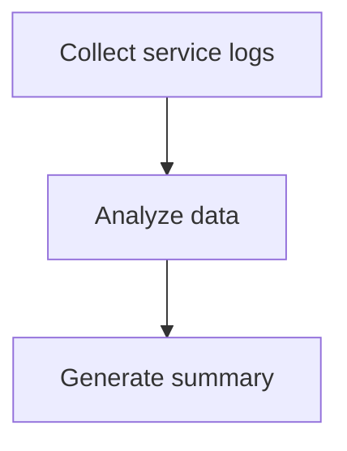

# Workflows

## What is a Workflow?

A workflow in AutoOps Architect is a **directed acyclic graph (DAG)** that represents an operations plan. It consists of:

- **Nodes**: Individual steps or actions
- **Edges**: Dependencies between nodes

## Workflow Schema

### JSON Format

```json
{
  "id": "wf-unique-id",
  "name": "Human-readable name",
  "goal_description": "Original goal that generated this workflow",
  "version": "1.0",
  "metadata": {
    "template": "optional_template_name",
    "tags": ["tag1", "tag2"]
  },
  "nodes": [
    {
      "id": "node-1",
      "name": "Node name",
      "description": "What this node does",
      "type": "log_collection",
      "tool": "log_collector",
      "params": {
        "service": "my-service"
      },
      "requires_human_approval": false,
      "timeout_seconds": 60,
      "retry_count": 0,
      "continue_on_failure": false
    }
  ],
  "edges": [
    {
      "from_node_id": "node-1",
      "to_node_id": "node-2",
      "condition": "optional_condition"
    }
  ]
}
```

### YAML Format

```yaml
id: wf-unique-id
name: Human-readable name
goal_description: Original goal that generated this workflow

nodes:
  - id: collect-logs
    name: Collect service logs
    type: log_collection
    tool: log_collector
    params:
      service: my-service
      duration: 1h

  - id: analyze
    name: Analyze data
    type: analysis
    tool: log_analyzer

edges:
  - from_node_id: collect-logs
    to_node_id: analyze
```

## Node Types

### Data Collection

| Type | Description | Common Tools |
|------|-------------|--------------|
| `log_collection` | Gather logs | `log_collector` |
| `metric_query` | Query metrics | `metric_query` |
| `trace_collection` | Collect traces | `trace_collector` |

### Analysis

| Type | Description | Common Tools |
|------|-------------|--------------|
| `rca_call` | Root cause analysis | `autoRCA` |
| `analysis` | General analysis | `log_analyzer` |
| `summary` | Generate summary | `summary` |

### Actions

| Type | Description | Common Tools |
|------|-------------|--------------|
| `ticket_create` | Create ticket | `secureMCP:jira` |
| `ticket_update` | Update ticket | `secureMCP:jira` |
| `notification` | Send notification | `secureMCP:slack` |
| `browser_replay` | Browser automation | `browser` |

### Remediation (Requires Approval)

| Type | Description | Common Tools |
|------|-------------|--------------|
| `service_restart` | Restart service | `shell` |
| `config_update` | Update config | `shell` |
| `rollback` | Rollback deployment | `shell` |
| `scale_action` | Scale resources | `shell` |

### Utility

| Type | Description |
|------|-------------|
| `wait` | Wait for condition |
| `decision` | Conditional branch |
| `human_review` | Explicit review step |
| `custom_script` | Custom script (requires approval) |

## Creating Workflows

### 1. From Natural Language

```bash
autoops plan "Investigate slow API responses" --service api-gateway
```

### 2. From YAML

Create a file `my-workflow.yaml`:

```yaml
id: wf-custom-001
name: Custom Investigation
goal_description: My custom investigation

nodes:
  - id: step-1
    name: First step
    type: analysis
    tool: echo
    params:
      message: "Starting investigation"

  - id: step-2
    name: Second step
    type: summary
    tool: summary

edges:
  - from_node_id: step-1
    to_node_id: step-2
```

Run it:

```bash
autoops run my-workflow.yaml
```

### 3. Programmatically

```python
from autoops_architect.models import Node, Edge, WorkflowGraph, NodeType

workflow = WorkflowGraph(
    id="wf-programmatic-001",
    name="Programmatic Workflow",
    goal_description="Created programmatically",
    nodes=[
        Node(
            id="step-1",
            name="First step",
            type=NodeType.ANALYSIS,
            tool="echo",
            params={"message": "Hello"}
        ),
    ],
    edges=[]
)
```

## Workflow Patterns

### Linear Pipeline

```
A ──▶ B ──▶ C ──▶ D
```

```yaml
edges:
  - from_node_id: A
    to_node_id: B
  - from_node_id: B
    to_node_id: C
  - from_node_id: C
    to_node_id: D
```

### Parallel Collection

```
    ┌──▶ B ──┐
A ──┤        ├──▶ D
    └──▶ C ──┘
```

```yaml
edges:
  - from_node_id: A
    to_node_id: B
  - from_node_id: A
    to_node_id: C
  - from_node_id: B
    to_node_id: D
  - from_node_id: C
    to_node_id: D
```

### Conditional Branch

```
A ──▶ B ──▶ C (if error)
      └──▶ D (otherwise)
```

```yaml
edges:
  - from_node_id: A
    to_node_id: B
  - from_node_id: B
    to_node_id: C
    condition: "status == 'error'"
  - from_node_id: B
    to_node_id: D
    condition: "status != 'error'"
```

## Execution Behavior

### Dependencies

- A node only executes when all its dependencies have completed
- Use edges to define execution order

### Failure Handling

```yaml
nodes:
  - id: risky-step
    name: Risky operation
    type: analysis
    tool: echo
    continue_on_failure: true  # Workflow continues even if this fails
```

### Human Approval

```yaml
nodes:
  - id: restart
    name: Restart service
    type: service_restart
    tool: shell
    requires_human_approval: true  # Execution pauses here
```

### Timeouts

```yaml
nodes:
  - id: slow-operation
    name: Slow operation
    type: analysis
    tool: custom
    timeout_seconds: 300  # 5 minute timeout
```

## Visualizing Workflows

### Mermaid Diagram

```bash
autoops plan "..." --mermaid
```

Output:


### Workflow Tree

```bash
autoops plan "..."
```

Output:
```
Workflow Steps
├── 🔧 [log_collection] Collect service logs
├── 🔧 [analysis] Analyze data
└── 🔧 [summary] Generate summary
```

## Best Practices

1. **Keep workflows focused** - One workflow per investigation type
2. **Use descriptive names** - Make node names self-documenting
3. **Parallel where possible** - Data collection can often be parallel
4. **Gate dangerous actions** - Always require approval for remediation
5. **Add context** - Use descriptions to explain why each step exists
6. **Handle failures gracefully** - Use `continue_on_failure` for non-critical steps
